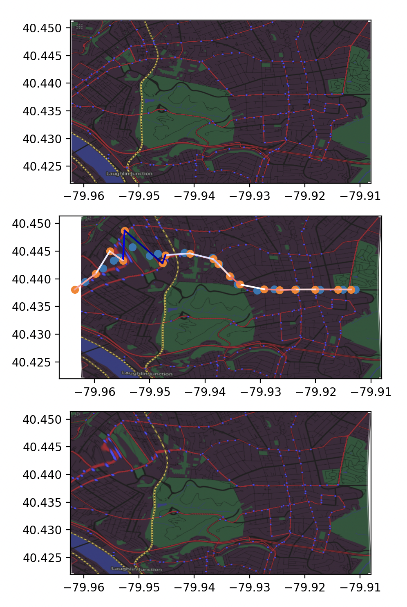

# Bus Map visualizer

## Goals
- Make a map which distorts to show which places are easily accessible by bus to and from each other

## Implementation Plan and Details

### Input Data
We can get GTFS (General Transit Feed Specification) data from PRT (Pittsburgh Regional Transit) to determine which areas should be "close" to each other.
This might take into consideration:

- Number of bus lines servicing bus stops
- Travel time between bus stops (latency)
- Average number of buses per unit time (throughput)

In order to take this data and transform it into a distorted map of Pittsburgh, we use a mass-and-springs model and Hooke's law to deform the locations of the bus stops.
The target length of the springs between adjacent bus stops can be calculated taking into account the factors listed above, and we can run a short physics simulation to determine the final positions.

We can get data from OpenStreetMaps to draw the map. The data look like a bunch of points which look like (latitude, longitude) and groupings of those points to indicate roads, buildings, and all the other things that would be on a map.

After that, we can use scikit-image's Thin Plate Spline deformation to deform the points from the OSM data based on the new bus stop positions and redraw the map.


Above is a demo of the mass-and-springs model using an inbound 61A bus line.

Parameters used here:
```
TIME_TO_LENGTH = 8e-5
NUM_ITERS = 500
K_SPRING = 0.01
K_GEO = 0.005
K_REPULSION = 2e-12
K_DAMPING = 0.7
```
